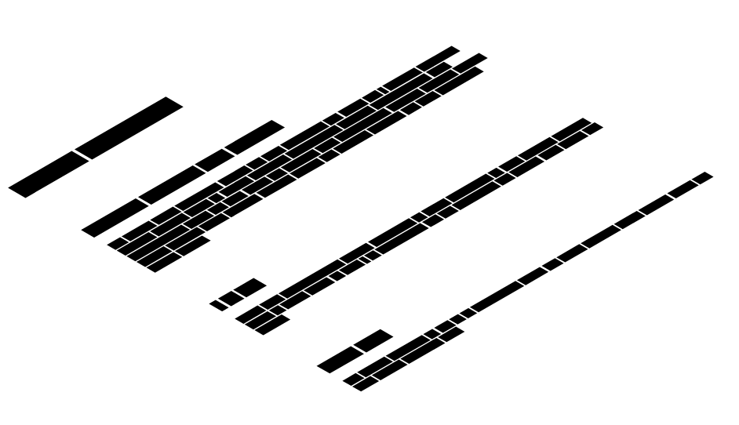

# concealed

Tired of Lorem Ipsum? Use dummy text blocks.

## Using

### Browser Global
```html
<head>
  ...
  <script src="concealed.js"></script>
</head>
<body>
  ...
  <h1 data-conceal="3"></h1>
  <div class="summary" data-conceal="15"></div>
  ...
  <script>
    Conceal()
  </script>
</body>
```

### Module

```
yarn install concealed
```

```js
import conceal from 'concealed'
import React from 'react'
import ReactDOM from 'react-dom'

const App = () => (
  <div>
    <div className="content">
      <h1 data-conceal="2"></h1>
    </div>
    <div className="content">
      <h2 data-conceal="4"></h2>
      <div className="summary" data-conceal="50"></div>
    </div>
    <div className="content">
      <h2 data-conceal="3"></h2>
      <div className="summary" data-conceal="30"></div>
    </div>
    <div className="content">
      <h2 data-conceal="2"></h2>
      <div className="summary" data-conceal="20"></div>
    </div>
  </div>
)

ReactDOM.render(
  <App />,
  document.body,
)

conceal()
```